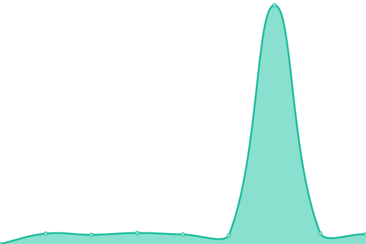

# [📈 Live Status](https://status.sukanyeah.com): <!--live status--> **🟩 All systems operational**

This repository contains the open-source uptime monitor and status page for [Sukanyeah Krishna](www.sukanyeah.com), powered by [Upptime](https://github.com/upptime/upptime).

With [Upptime](https://upptime.js.org), you can get your own unlimited and free uptime monitor and status page, powered entirely by a GitHub repository. We use [Issues](https://github.com/Sukanyeah/upptime/issues) as incident reports, [Actions](https://github.com/Sukanyeah/upptime/actions) as uptime monitors, and [Pages](https://status.sukanyeah.com) for the status page.

<!--start: status pages-->
<!-- This summary is generated by Upptime (https://github.com/upptime/upptime) -->
<!-- Do not edit this manually, your changes will be overwritten -->
<!-- prettier-ignore -->
| URL | Status | History | Response Time | Uptime |
| --- | ------ | ------- | ------------- | ------ |
|  [Sukanyeah.com](https://www.sukanyeah.com) | 🟩 Up | [sukanyeah-com.yml](https://github.com/Sukanyeah/Uptime/commits/HEAD/history/sukanyeah-com.yml) | 

 767ms
     
 | 

<a href="https://status.sukanyeah.com/history/sukanyeah-com">100.00%</a>
    

|  [1Account.org](https://www.1account.org) | 🟩 Up | [1-account-org.yml](https://github.com/Sukanyeah/Uptime/commits/HEAD/history/1-account-org.yml) | 

 881ms
     
 | 

<a href="https://status.sukanyeah.com/history/1-account-org">100.00%</a>
    

|  [Sukanyeah Blog](https://ml.sukanyeah.com) | 🟩 Up | [sukanyeah-blog.yml](https://github.com/Sukanyeah/Uptime/commits/HEAD/history/sukanyeah-blog.yml) | 

 986ms
     
 | 

<a href="https://status.sukanyeah.com/history/sukanyeah-blog">100.00%</a>
    

|  [Sukanyeah No Hello](https://nohello.sukanyeah.com) | 🟩 Up | [sukanyeah-no-hello.yml](https://github.com/Sukanyeah/Uptime/commits/HEAD/history/sukanyeah-no-hello.yml) | 

 1238ms
     
 | 

<a href="https://status.sukanyeah.com/history/sukanyeah-no-hello">100.00%</a>
    

|  [Sukanyeah.in](https://www.sukanyeah.in) | 🟩 Up | [sukanyeah-in.yml](https://github.com/Sukanyeah/Uptime/commits/HEAD/history/sukanyeah-in.yml) | 

 1471ms
     
 | 

<a href="https://status.sukanyeah.com/history/sukanyeah-in">100.00%</a>
    

|  [Syah.in](https://www.syah.in) | 🟩 Up | [syah-in.yml](https://github.com/Sukanyeah/Uptime/commits/HEAD/history/syah-in.yml) | 

 734ms
     
 | 

<a href="https://status.sukanyeah.com/history/syah-in">100.00%</a>
    

<!--end: status pages-->

[**Visit our status website →**](https://status.sukanyeah.com)

## 📄 License

- Powered by: [Upptime](https://github.com/upptime/upptime)
- Code: [MIT](./LICENSE) © [Anand Chowdhary](https://anandchowdhary.com), supported by [Pabio](https://pabio.com)
- Data in the `./history` directory: [Open Database License](https://opendatacommons.org/licenses/odbl/1-0/)
